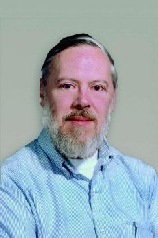

# CS100 Lecture 1

Warmup for C

---

## Contents

- Brief history of C
- The first C program
  - Functions (basic) and the `main` function
  - Data types
  - `scanf` and `printf`

---

# Brief history of C

---

## The UNIX operating system and C

- In 1969, a small group of AT&T Bell Labs led by **Ken Thompson** and **Dennis Ritchie** began to develop UNIX.
- In 1973, UNIX kernel was rewritten in C.
- From 1969 to 1973, Dennis Ritchie developed C in Bell Labs.
- In 1978, Kernighan and Ritchie published **the K&R book**: *The C Programming Language*.

---

## Dennis Ritchie and the K&R book

<div style="display: grid; grid-template-columns: 1fr 1fr;">
  <div>
    <a align="center">
      
      
    </a>
  </div>
  <div>

- Dennis M. Ritchie (1941 - 2011)
  - The inventor of C
  - Co-inventor of UNIX
  - ACM Turing Award (1983) with Ken Thompson for UNIX

  </div>
</div>

---

## Standardization of C

- "K&R C": Informal specification (the K&R book)
- ANSI C: Known as "C89"
  - **A**merican **N**ational **S**tandards **I**nstitute
  - Came out in 1989
- ISO C standard: ISO/IEC 9899
  - **I**nternational **O**rganization for **S**tandardization
  - First version: "C90" in 1990, the same standard as C89 with only formatting changes
  - C99 (1999), C11 (2011), C17 (2017/2018), C23 (2023)

---

# The first C program

---

## Hello World

```c
#include <stdio.h>

int main(void) {
  printf("hello world\n");
  return 0;
}
```

- Save the code as `hello.c`.
- `gcc hello.c -o hello.exe` $\Rightarrow$ generates `hello.exe`
- `.\hello.exe` $\Rightarrow$ prints `hello world`, with a newline at the end.

---

## [The `main` function](http://en.cppreference.com/w/c/language/main_function)

Every C program coded to run in a hosted execution environment contains the definition of a **function** named **`main`**, which is the designated start of the program.

```c
int main(void) {
  // The program starts here.
  statement_1;
  statement_2;
  // ...
  statement_n;
}
```

---

## A function in C

