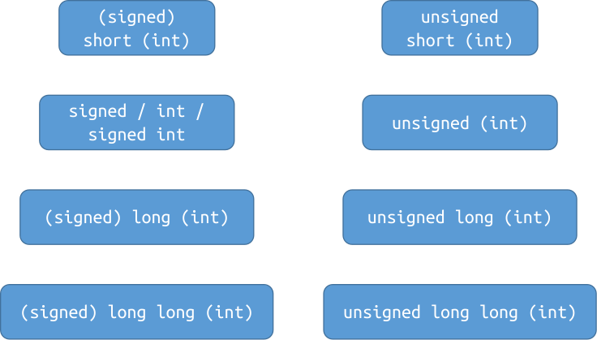

# CS100 Lecture 2

Variables and Arithmetic Types

---

## Contents

- Variable declaration
- Arithmetic types
  - Bits and bytes
  - Integer types
  - Real floating types
  - Character types
  - Boolean type

---

# Variable declaration

---

## Type of a variable

Every variable in C has a type.

- The type is **fully deterministic** and **cannot be changed**.
- The type is **known even when the program is not run**.
  - $\Leftrightarrow$ The type is known at **compile-time**.
  - $\Leftrightarrow$ C is **statically-typed**. $\Leftrightarrow$ C has a **static type system**.
  - In contrast, Python is **dynamically-typed**.

\*Note: The type of every variable is determined at compile-time *except for variable-length arrays (since C99)*.

---

## Statically-typed vs dynamically-typed

<div style="display: grid; grid-template-columns: 1fr 1fr;">
  <div>

Python: dynamically typed

```python
a = 42       # Type of a is int.
a = "hello"  # Type of a becomes str.
```

The type of a variable

- can be changed, and
- is not necessarily known until we run the program.

  </div>
  <div>

C: statically-typed

```c
int a = 42;  // Type of a is int.
a = "hello"; // Error! Types mismatch!
```

The type of a variable

- is explicitly written on declaration, and
- is known at compile-time, and
- cannot be changed.
  </div>
</div>

A type-related error in C is *(usually)* a **compile error**:
- It stops the compiler. The executable will not generated.

---

## Declare a variable

To declare a variable, we need to specify its **type** and **name**.

```c
Type name;
```

Example:

```c
int x;    // Declares a variable named `x`, whose type is `int`.
double y; // Declares a variable named `y`, whose type is `double`.
```

We may declare multiple variables of a same type in one declaration statement, separated by `,`.

```c
int x, y; // Declares two variables `x` and `y`, both having type `int`.
```

---

## Declare a variable

A **variable declaration** can be placed

- inside a function, which declares a **local variable**, or
- outside of any functions, which declares a **global variable**.

<div style="display: grid; grid-template-columns: 1fr 1fr;">
  <div>

```c
#include <stdio.h>

int x, y; // global variables

int main(void) {
  scanf("%d%d", &x, &y);
  printf("%d\n", x + y);
}
```
  </div>
  <div>

```c
#include <stdio.h>

int main(void) {
  // local variables in `main`
  int x, y;
  scanf("%d%d", &x, &y);
  printf("%d\n", x + y);
}
```
  </div>
</div>

---

## Local variables vs global variables

Which one do you prefer?

<div style="display: grid; grid-template-columns: 1fr 1fr;">
  <div>

```c
#include <stdio.h>

int x, y; // global variables

int main(void) {
  scanf("%d%d", &x, &y);
  printf("%d\n", x + y);
}
```
  </div>
  <div>

```c
#include <stdio.h>

int main(void) {
  // local variables in `main`
  int x, y;
  scanf("%d%d", &x, &y);
  printf("%d\n", x + y);
}
```
  </div>
</div>

---

## What are these variables used for?

```c
#include <stdio.h>
// Other #includes

int x, y; // What are these two variables used for?

int moveSpaceShuttle(SpaceShuttle *shuttle, Coord to, Vehicle *by) {
  // 109 lines
}
int makePreparations(Environment *env, Task tasks[], Time time) {
  // 73 lines
}
LaunchResult launchSpaceShuttle(SpaceShuttle *shuttle, Task tasks[]) {
  // 35 lines
}
// Other 136 functions, 3325 lines in total
int main(void) {
  // 120 lines
}
```

---

## Readability matters

Declare the variable when you first use it!

- If the declaration and use of the variable are too separated, it will become much more difficult to figure out what they are used for as the program goes longer.

Use meaningful names!

- The program would be a mess if polluted with names like `a`, `b`, `c`, `d`, `x`, `y`, `cnt`, `cnt_2`, `flag1`, `flag2`, `flag3` everywhere.
- Use meaningful names: `sumOfScore`, `student_cnt`, `open_success`, ...

**Readability is very important.** Many students debug day and night simply because their programs are not human-readable.

---

## Initialize a variable

A variable can be **initialized** on declaration.

```c
int x = 42; // Declares the variable `x` of type `int`,
            // and initializes its value to 42.
int a = 0, b, c = 42; // Declares three `int` variables, with `a` initialized
                      // to 0, `c` initialized to 42, and `b` uninitialized.
```

This is syntactically **different** (though seems equivalent) to

```c
int x;  // Declares `x`, uninitialized.
x = 42; // Assigns 42 to `x`.
```

**Initialize the variable if possible. Prefer initialization to later assignment.**

$\Rightarrow$ More on initialization in later lectures.

---

# Arithmetic types

Refer to [this page](https://en.cppreference.com/w/c/language/arithmetic_types) for a complete, detailed and standard documentation.

---

## Integer types

Is `int` equivalent to $\mathbb Z$?

- Is there a limitation on the numbers that `int` can represent?

---

## Integer types

Is `int` equivalent to $\mathbb Z$?

- Is there a limitation on the numbers that `int` can represent?

Experiment:

<div style="display: grid; grid-template-columns: 1fr 1fr;">
  <div>

```c
#include <stdio.h>

int main(void) {
  int x = 1;
  while (1) {
    printf("%d\n", x);
    x *= 2;
    getchar();
  }
}
```
  </div>
  <div>

- On 64-bit Ubuntu 22.04 and compiled with GCC 13, after printing `1073741824` ($2^{30}$), the output becomes negative, and then `0`.
  
  ```
  1073741824
  -2147483648
  0
  0
  ```
  </div>
</div>

---

## Bits and bytes

Information is stored in computers **in binary**.

- $42_{\text{ten}}=101010_{\text{two}}$.

A **bit** is either $0$ or $1$.

- The binary representation of $42$ consists of $6$ bits.

A **byte** is *(most commonly)* $8$ bits grouped together like $10001001$.

- At least $1$ byte is needed to store $42$.
- At least $3$ bytes are needed to store $142857_{\text{ten}}=100010111000001001_{\text{two}}$

[Is a byte always 8 bits?](https://en.wikipedia.org/wiki/36-bit_computing)

---

## Bits and bytes

Suppose now we have $n$ bits.

- How many different values can be represented?
- What is the largest integer that can be represented?
- How do we represent negative numbers? Non-integer values? ...

---

## Bits and bytes

Suppose now we have $n$ bits.

- How many different values can be represented?
  - $2^n$.
- What is the largest integer that can be represented?
  - $2^n-1=\underbrace{111\dots 1}_{n}{}_{\text{two}}$.
- How do we represent negative numbers? Non-integer values? ...
  - There are several different [signed number representations](https://en.wikipedia.org/wiki/Signed_number_representations), among which **two's complement** is widely used.
  - About floating-point numbers: [IEEE754](https://en.wikipedia.org/wiki/IEEE_754)
  - Details are not covered in CS100.

---

## Note

There are several different signed number representations, but all popular machines and almost all compilers use **two's complement**.

Since C23 (and C++20), two's complement is the only representation allowed by the standard.

Although C17 and C++17 are used for CS100, we still assume that signed numbers are always represented by two's complement.

---

## Integer types

An integer type in C is either **signed** or **unsigned**, and has a **width** denoting the number of bits that can be used to represent values.

Suppose we have an integer type of $n$ bits in width.

- If the type is **signed**, the range of values that can be represented is $\left[-2^{n-1},2^{n-1}-1\right]$.
- If the type is **unsigned**, the range of values that can be represented is $\left[0, 2^n-1\right]$.

---

## Integer types

<a align="center">
  
</a>

---

## Integer types

- The keyword `int` is optional in types other than `int`:
  - e.g. `short int` and `short` name the same type.
  - e.g. `unsigned int` and `unsigned` name the same type.

- "Unsigned-ness" needs to be written explicitly: `unsigned int`, `unsigned long`, ...
- Types without the keyword `unsigned` are signed by default:
  - e.g. `signed int` and `int` name the same type.
  - e.g. `signed long int`, `signed long`, `long int` and `long` name the same type.

---

## Width of integer types

<div align="center">

| type        | width (at least) | width (usually) |
| ----------- | ---------------- | --------------- |
| `short`     | 16 bits          | 16 bits         |
| `int`       | 16 bits          | 32 bits         |
| `long`      | 32 bits          | 32 or 64 bits   |
| `long long` | 64 bits          | 64 bits         |
</div>

- A signed type has the same width as its `unsigned` counterpart.
- **It is also guaranteed that `sizeof(short)` $\leqslant$ `sizeof(int)` $\leqslant$ `sizeof(long)` $\leqslant$ `sizeof(long long)`.**
  - `sizeof(T)` is the number of **bytes** that `T` holds.

---

## Implementation-defined behaviors

The standard states that the exact width of the integer types is **implementation-defined**.

- **Implementation**: The compiler and the standard library.
- An implementation-defined behavior depends on the compiler and the standard library, and is often also related to the hosted environment (e.g. the operating system).

---

## Which one should I use?

**`int` is the most optimal integer type for the platform.**

- Use `int` for integer arithmetic by default.
- Use `long long` if the range of `int` is not large enough.
- Use smaller types (`short`, or even `unsigned char`) for memory-saving or other special purposes.
- Use `unsigned` types for special purposes. We will see some in later lectures.

---

## Real floating types

"Floating-point": The number's radix point can "float" anywhere to the left, right, or between the significant digits of the number.

Real floating-point types can be used to represent *some* real values.

- Real floating-point types $\neq\mathbb R$.

---

## Real floating types

C has three types for representing real floating-point values:

- `float`: single precision. Matches [IEEE754 binary32 format](https://en.wikipedia.org/wiki/Single-precision_floating-point_format) if supported.
- `double`: double precision. Matches [IEEE754 binary64 format](https://en.wikipedia.org/wiki/Double-precision_floating-point_format) if supported.
- `long double`: extended precision. A floating-point type whose precision and range are at least as good as those of `double`.

Details of IEEE754 formats are not required in CS100.

Range of values can be found in [this table](https://en.cppreference.com/w/c/language/arithmetic_types#Range_of_values).

---

## Which one should I use?

Use `double` for real floating-point arithmetic by default.

- In some cases the precision of `float` is not enough.
- Don't worry about efficiency! `double` arithmetic is not necessarily slower than `float`.

**Do not use floating-point types for integer arithmetic!**

---

## `scanf`/`printf`

Refer to the table in [this page](https://en.cppreference.com/w/c/io/fscanf).

<div style="display: grid; grid-template-columns: 1fr 1fr;">
  <div align="center">

| type        | format specifier |
| ----------- | ---------------- |
| `short`     | `%hd`            |
| `int`       | `%d`             |
| `long`      | `%ld`            |
| `long long` | `%lld`           |
  </div>
  <div align="center">

| type                 | format specifier |
| -------------------- | ---------------- |
| `unsigned short`     | `%hu`            |
| `unsigned`           | `%u`             |
| `unsigned long`      | `%lu`            |
| `unsigned long long` | `%llu`           |
  </div>
</div>

- `%f` for `float`, `%lf` for `double`, and `%Lf` for `long double`.

---

## Exercise

Write the "A+B" program for real numbers. Which type do you decide to use? How do you read and print the values?