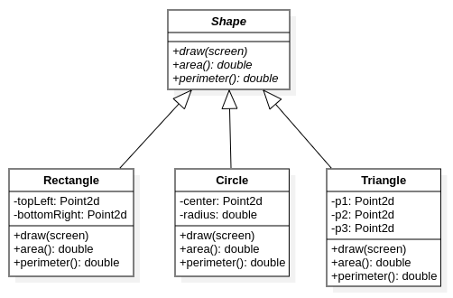
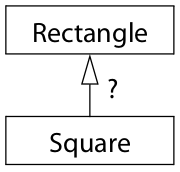

# CS100 Lecture 22

Inheritance and Polymorphism <span style="color: black; font-family: Times New Roman; font-size: 1.05em;">II</span>

---

## Contents

- Abstract base class
- More on the "is-a" relationship (*Effective C++* Item 32)
- Inheritance of interface vs inheritance of implementation (*Effective C++* Item 34)

---

# Abstract base class

---

## Shapes

Define different shapes: Rectangle, Triangle, Circle, ...

Suppose we want to draw things like this:

```cpp
void drawThings(ScreenHandle &screen,
                const std::vector<std::shared_ptr<Shape>> &shapes) {
  for (const auto &shape : shapes)
    shape->draw(screen);
}
```

and print information:

```cpp
void printShapeInfo(const Shape &shape) {
  std::cout << "Area: " << shape.area()
            << "Perimeter: " << shape.perimeter() << std::endl;
}
```

---

## Shapes

Define a base class `Shape` and let other shapes inherit it.

```cpp
class Shape {
public:
  Shape() = default;
  virtual void draw(ScreenHandle &screen) const;
  virtual double area() const;
  virtual double perimeter() const;
  virtual ~Shape() = default;
};
```

Different shapes should define their own `draw`, `area`  and `perimeter`, so these functions should be `virtual`.

---

## Shapes

```cpp
class Rectangle : public Shape {
  Point2d mTopLeft, mBottomRight;

public:
  Rectangle(const Point2d &tl, const Point2d &br)
      : mTopLeft(tl), mBottomRight(br) {} // Base is default-initialized
  void draw(ScreenHandle &screen) const override { /* ... */ }
  double area() const override {
    return (mBottomRight.x - mTopLeft.x) * (mBottomRight.y - mTopLeft.y);
  }
  double perimeter() const override {
    return 2 * (mBottomRight.x - mTopLeft.x + mBottomRight.y - mTopLeft.y);
  }
};
```

---

## Shapes

<a align="center">
  
</a>

---

## Pure `virtual` functions

How should we define `Shape::draw`, `Shape::area` and `Shape::perimeter`?

- For the general concept "Shape", there is no way to determine the behaviors of these functions.

---

## Pure `virtual` functions

How should we define `Shape::draw`, `Shape::area` and `Shape::perimeter`?

- For the general concept "Shape", there is no way to determine the behaviors of these functions.
- Direct call to `Shape::draw`, `Shape::area` and `Shape::perimeter` should be forbidden.
- We shouldn't even allow an object of type `Shape` to be instantiated! The class `Shape` is only used to **define the concept "Shape" and required interfaces**.

---

## Pure `virtual` functions

If a `virtual` function does not have a reasonable definition in the base class, it should be declared as **pure `virtual`** by writing `=0`.

```cpp
class Shape {
public:
  virtual void draw(ScreenHandle &) const = 0;
  virtual double area() const = 0;
  virtual double perimeter() const = 0;
  virtual ~Shape() = default;
};
```

Any class that has a **pure `virtual` function** is an **abstract class**. Pure `virtual` functions (usually) cannot be called, and abstract classes cannot be instantiated.

---

## Pure `virtual` functions and abstract classes

Any class that has a **pure `virtual` function** is an **abstract class**. Pure `virtual` functions (usually) cannot be called, and abstract classes cannot be instantiated.

```cpp
Shape shape; // Error.
Shape *p = new Shape; // Error.
auto sp = std::make_shared<Shape>(); // Error.
std::shared_ptr<Shape> sp2 = std::make_shared<Rectangle>(p1, p2); // OK.
```

We can define pointer or reference to an abstract class, but never an object of that type!

---

## Pure `virtual` functions and abstract classes

A non-pure `virtual` function **must be defined**. Otherwise, the compiler will fail to generate necessary runtime information (the virtual table), which leads to an error.

```cpp
class X {
  virtual void foo(); // Declaration, without a definition
  // Even if `foo` is not used, this will lead to an error.
};
```

Linkage error:

```
/usr/bin/ld: /tmp/ccV9TNfM.o: in function `main':
a.cpp:(.text+0x1e): undefined reference to `vtable for X'
```

---

## Make the interface robust, not error-prone.

Is this good?

```cpp
class Shape {
public:
  virtual double area() const {
    return 0;
  }
};
```

What about this?

```cpp
class Shape {
public:
  virtual double area() const {
    throw std::logic_error{"area() called on Shape!"};
  }
};
```

---

## Make the interface robust, not error-prone.

```cpp
class Shape {
public:
  virtual double area() const {
    return 0;
  }
};
```

If `Shape::area` is called accidentally, the error will happen ***silently***!

---

## Make the interface robust, not error-prone.

```cpp
class Shape {
public:
  virtual double area() const {
    throw std::logic_error{"area() called on Shape!"};
  }
};
```

If `Shape::area` is called accidentally, an exception will be raised.

However, **a good design should make errors fail to compile**.

**[Best practice]** <u>If an error can be caught in compile-time, don't leave it until run-time.</u>

---

## Polymorphism (多态)

Polymorphism: The provision of a single interface to entities of different types, or the use of a single symbol to represent multiple different types.

- Run-time polymorphism: Achieved via **dynamic binding**.
- Compile-time polymorphism: Achieved via **function overloading**, **templates**, **concepts (since C++20)**, etc.

<div style="display: grid; grid-template-columns: 1fr 1fr;">
  <div>

Run-time polymorphism:

```cpp
struct Shape {
  virtual void draw() const = 0;
};
void drawStuff(const Shape &s) {
  s.draw();
}
```
  </div>
  <div>

Compile-time polymorphism:

```cpp
template <typename T>
concept Shape = requires(const T x) {
  x.draw();
};
void drawStuff(Shape const auto &s) {
  s.draw();
}
```
  </div>
</div>

---

# More on the "is-a" relationship

*Effective C++* Item 32

---

## Public inheritance: The "is-a" relationship

By writing that class `D` publicly inherits from class `B`, you are telling the compiler (as well as human readers of your code) that

- Every object of type `D` ***is*** also ***an*** object of type `B`, but not vice versa.
- `B` represents a **more general concept** than `D`, and that `D` represents a **more specialized concept** than `B`.

More specifically, you are asserting that **anywhere an object of type `B` can be used, an object of type `D` can be used just as well**.
- On the other hand, if you need an object of type `D`, an object of type `B` won't do.

---

## Example: Every student *is a* person.

```cpp
class Person { /* ... */ };
class Student : public Person { /* ... */ };
```

- Every student ***is a*** person, but not every person is a student.
- Anything that is true of a person is also true of a student:

  - A person has a date of birth, so does a student.
- Something is true of a student, but not true of people in general.
  
  - A student is entrolled in a particular school, but a person may not.

The notion of a person is **more general** than is that of a student; a student is **a specialized type** of person.

---

## Example: Every student *is a* person.

The **is-a** relationship: Anywhere an object of type `Person` can be used, an object of type `Student` can be used just as well, **but not vice versa**.

```cpp
void eat(const Person &p);    // Anyone can eat.
void study(const Student &s); // Only students study.
Person p;
Student s;
eat(p);   // Fine. `p` is a person.
eat(s);   // Fine. `s` is a student, and a student is a person.
study(s); // Fine.
study(p); // Error! `p` isn't a student.
```

---

## Your intuition can mislead you.

- A penguin **is a** bird.
- A bird can fly.

If we naively try to express this in C++, our effort yields:

```cpp
class Bird {
public:
  virtual void fly();         // Birds can fly.
  // ...
};
class Penguin : public Bird { // A penguin is a bird.
  // ...
};
```

```cpp
Penguin p;
p.fly();    // Oh no!! Penguins cannot fly, but this code compiles!
```

---

## No. Not every bird can fly.

***In general***, birds have the ability to fly.

- Strictly speaking, there are several types of non-flying birds.

Maybe the following hierarchy models the reality much better?

```cpp
class Bird { /* ... */ };
class FlyingBird : public Bird {
  virtual void fly();
};
class Penguin : public Bird {   // Not FlyingBird
  // ...
};
```

---

## No. Not every bird can fly.

Maybe the following hierarchy models the reality much better?

```cpp
class Bird { /* ... */ };
class FlyingBird : public Bird {
  virtual void fly();
};
class Penguin : public Bird {   // Not FlyingBird
  // ...
};
```

- **Not necessarily.** If your application has much to do with beaks and wings, and nothing to do with flying, the original two-class hierarchy might be satisfactory.
- **There is no one ideal design for every software.** The best design depends on what the system is expected to do.

---

## What about report a runtime error?

```cpp
void report_error(const std::string &msg); // defined elsewhere
class Penguin : public Bird {
public:
  virtual void fly() {
    report_error("Attempt to make a penguin fly!");
  }
};
```

---

## What about report a runtime error?

```cpp
void report_error(const std::string &msg); // defined elsewhere
class Penguin : public Bird {
public:
  virtual void fly() { report_error("Attempt to make a penguin fly!"); }
};
```

**No.** This does not say "Penguins can't fly." This says **"Penguins can fly, but it is an error for them to actually try to do it."**

To actually express the constraint "Penguins can't fly", you should prevent the attempt from **compiling**.

```cpp
Penguin p;
p.fly(); // This should not compile.
```

**[Best practice]** <u>Good interfaces prevent invalid code from **compiling**.</u>

---

## Example: A square *is a* rectangle.

Should class `Square` publicly inherit from class `Rectangle`?

<a align="center">
  
</a>

---

## Example: A square *is a* rectangle.

Consider this code.

<div style="display: grid; grid-template-columns: 1fr 1fr;">
  <div>

```cpp
class Rectangle {
public:
  virtual void setHeight(int newHeight);
  virtual void setWidth(int newWidth);
  virtual int getHeight() const;
  virtual int getWidth() const;
  // ...
};
void makeBigger(Rectangle &r) {
  r.setWidth(r.getWidth() + 10);
}
```

  </div>
  <div>

```cpp
class Square : public Rectangle {
  // A square is a rectangle,
  // where height == width.
  // ...
};

Square s(10);  // A 10x10 square.
makeBigger(s); // Oh no!
```
  </div>
</div>

---

## Is this really an "is-a" relationship?

We said before that the "is-a" relationship means that **anywhere an object of type `B` can be used, an object of type `D` can be used just as well**.

However, something applicable to a rectangle is not applicable to a square!

### Conclusion:

Public inheritance means "is-a". Everything that applies to base classes must also apply to derived classes, because every derived class object is a base class object.

---

