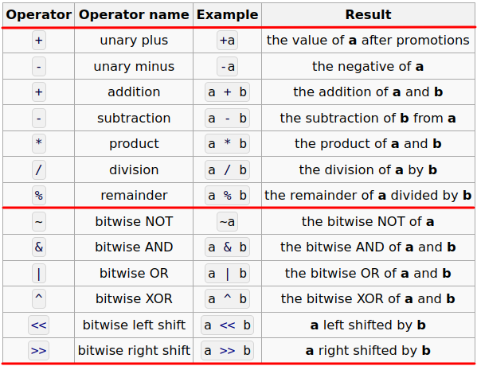

# CS100 Lecture 3

Arithmetic Operators (1) and Control Flow

---

## Contents

- Arithmetic operators (1)
  - `+`, `-`, `*`, `/`, `%`
  - Compound assignment operators
  - Signed integer overflow
- Control flow
  - `if`-`else`
  - `while`
  - `for`
  - `do`-`while`

---

# Arithmetic operators (1)

---

## The calculator

Accept input of the form `x op y`, where `x` and `y` are floating-point numbers and `op` $\in\{$ `'+'`, `'-'`, `'*'`, `'/'` $\}$. Print the result.

<div style="display: grid; grid-template-columns: 1fr 1fr;">
  <div>

```c
#include <stdio.h>

int main(void) {
  double x, y;
  char op;
  scanf("%lf %c %lf", &x, &op, &y);
  if (op == '+')
    printf("%lf\n", x + y);
  else if (op == '-')
    printf("%lf\n", x - y);
```
  </div>
  <div>

```c
  else if (op == '*')
    printf("%lf\n", x * y);
  else if (op == '/')
    printf("%lf\n", x / y);
  else
    printf("Invalid operator.\n");
  return 0;
}
```
  </div>
</div>

---

## Overview of arithmetic operators

<a align="center">
  
</a>

---

## `+`, `-`, `*`, `/`, `%`

- `+` and `-` have two versions: unary (`+a`, `-a`) and binary (`a+b`, `a-b`).
  - The unary `+`/`-` and binary `+`/`-` are **different operators**, although they use the same notation.
- Operator precedence:
  
  $\{$ unary `+`, unary `-` $\}>\{$ `*`, `/`, `%` $\}>\{$ binary `+`, binary `-` $\}$

  $\Rightarrow$ We will talk more about operator precedence later.

---

## Binary `+`, `-` and `*`, `/`

`a + b`, `a - b`, `a * b`, `a / b`

Before the evaluation of such an expression, the operands (`a`, `b`) will undergo a sequence of **type conversions**.

- The [detailed rules of the conversions](https://en.cppreference.com/w/c/language/conversion#Usual_arithmetic_conversions) are very complex,
  - including *promotions*, conversions between `signed` and `unsigned` types, conversions between integers and floating-point types, etc.
  - We only need to remember some common ones.
- In the end, the operands will be converted to **a same type**, denoted `T`. **The result type is also `T`.**

---

## Binary `+`, `-` and `*`, `/`

`a + b`, `a - b`, `a * b`, `a / b`

If any one operand is of floating-point type and the other is an integer, **the integer will be implicitly converted to that floating-point type**.

Example:

```c
double pi = 3.14;
int diameter = 20;
WhatType c = pi * diameter; // What is the type of this result?
```

---

## Binary `+`, `-` and `*`, `/`

`a + b`, `a - b`, `a * b`, `a / b`

If any one operand is of floating-point type and the other is an integer, **the integer will be implicitly converted to that floating-point type**.

Example:

```c
double pi = 3.14;
int diameter = 20;
double c = pi * diameter; // 62.8
```

The value of `diameter` is implicitly converted to a value of type `double`. Then, a floating-point multiplication is performed, yielding a result of type `double`.

\* Does this rule make sense?

---

## Binary `+`, `-` and `*`, `/`

`a + b`, `a - b`, `a * b`, `a / b`

If any one operand is of floating-point type and the other is an integer, **the integer will be implicitly converted to that floating-point type**.

Example:

```c
double pi = 3.14;
int diameter = 20;
double c = pi * diameter; // 62.8
```

The value of `diameter` is implicitly converted to a value of type `double`. Then, a floating-point multiplication is performed, yielding a result of type `double`.

\* Does this rule make sense? - Yes, because $\mathbb Z\subseteq\mathbb R$.

---

## Binary `+`, `-` and `*`, `/`

`a + b`, `a - b`, `a * b`, `a / b`

If any one operand is of floating-point type and the other is an integer, **the integer will be implicitly converted to that floating-point type**, and the result type is that floating-point type.

Similarly, if the operands are of types `int` and `long long`, the `int` value will be implicitly converted to `long long`, and the result type is `long long`. ${}^{\textcolor{red}{1}}$

---

## Division: `a / b`

Assume `a` and `b` are of the same type `T` (after conversions as mentioned above).
- Then, the result type is also `T`.

Two cases:

- If `T` is a floating-point type, this is a floating-point division.
- If `T` is an integer type, this is an integer division.

---

## Division: `a / b`

Two cases:

- If `T` is a floating-point type, this is a floating-point division.
  - The result is no surprising.
- If `T` is an integer type, this is an integer division.
  - The result is **truncated towards zero** (since C99 and C++11) ${}^{\textcolor{red}{2}}$.
  - What is the result of `3 / -2`?

Let `a` and `b` be two integers.

- What is the difference between `a / 2` and `a / 2.0`?
- What does `(a + 0.0) / b` mean? What about `1.0 * a / b`?

---

## Division: `a / b`

If `T` is an integer type, this is an integer division.
  - The result is **truncated towards zero** (since C99 and C++11) ${}^{\textcolor{red}{2}}$.
  - What is the result of `3 / -2`?
    - `-1.5` truncated towards zero, which is `-1`.


What is the difference between `a / 2` and `a / 2.0`?
  - `a / 2` yields an integer, while `a / 2.0` yields a `double`.

What does `(a + 0.0) / b` mean? What about `1.0 * a / b`?
  - Both use floating-point division to compute $\dfrac ab$. The floating-point numbers `0.0` and `1.0` here cause the conversion of the other operands.

---

## Remainder: `a % b`

Example: `15 % 4 == 3`.

**`a` and `b` must have integer types.**

If `a` is negative, is the result negative? What if `b` is negative? What if both are negative?

---

## Remainder: `a % b`

Example: `15 % 4 == 3`.

**`a` and `b` must have integer types.**

~~If `a` is negative, is the result negative? What if `b` is negative? What if both are negative?~~

For any integers `a` and `b`, the following always holds:

<div align="center">

```c
(a / b) * b + (a % b) == a
```
</div>

---

## Compound assignment operators

`+=`, `-=`, `*=`, `/=`, `%=`

- `a op= b` is equivalent to `a = a op b`.
- e.g. `x *= 2` is equivalent to `x = x * 2`.
- **[Best practice]** <u>Learn to use these operators, to make your code clear and simple.</u>

---

## Signed integer overflow

If a **signed integer type** holds a value that is not in the valid range, **overflow** is caused.

Suppose `int` is 32-bit and `long long` is 64-bit.

Do the following computations cause overflow?

```c
int ival = 100000; long long llval = ival;
int result1 = ival * ival;
long long result2 = ival * ival;
long long result3 = llval * ival;
long long result4 = llval * ival * ival;
```

---

## Signed integer overflow

Suppose `int` is 32-bit and `long long` is 64-bit.

Do the following computations cause overflow?

```c
int ival = 100000; long long llval = ival;
int result1 = ival * ival;               // (1) overflow
long long result2 = ival * ival;         // (2) overflow
long long result3 = llval * ival;        // (3) not overflow
long long result4 = llval * ival * ival; // (4) not overflow
```

(1) $\left(10^5\right)^2=10^{10}>2^{31}-1$.

(2) The result type of the multiplication `ival * ival` is **`int`**, which causes overflow. This is not affected by the type of `result2`.

---

## Signed integer overflow

Suppose `int` is 32-bit and `long long` is 64-bit.

Do the following computations cause overflow?

```c
int ival = 100000; long long llval = ival;
int result1 = ival * ival;               // (1) overflow
long long result2 = ival * ival;         // (2) overflow
long long result3 = llval * ival;        // (3) not overflow
long long result4 = llval * ival * ival; // (4) not overflow
```

(3) Since `llval` is of type `long long`, the value of `ival` will be implicitly converted to `long long`, and then the multiplication yields a `long long` value.

(4) `*` is **left-associative**, so the expression `a * b * c` is interpreted as `(a * b) * c`.

$\Rightarrow$ We will talk about associativity in later lectures.

---

## Undefined behavior

Signed integer overflow is [**undefined behavior**](https://en.cppreference.com/w/c/language/behavior): **There are no restrictions on the behavior of the program.** Compilers are not required to diagnose undefined behavior (although many simple situations are diagnosed), and the compiled program is not required to do anything meaningful.

- It may yield some garbage values, or zero, or anything else;
- or, this statement may be removed if the compiler is clever enough;
- or, the program may crash;
- or, any other results.

$\Rightarrow$ More on undefined behaviors in recitations.

---

## Unsigned integers never overflow

Unsigned integer arithmetic is always performed *modulo $2^n$*, where $n$ is the number of bits in that integer type.

e.g. For `unsigned int`, adding one to $2^{32}-1$ gives $0$, and subtracting one from $0$ gives $2^{32}-1$ (assuming `unsigned int` is 32-bit).

---

# Control flow

---