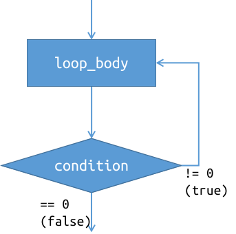

# CS100 Lecture 4

Operators and Control Flow <span style="color: black; font-family: Times New Roman; font-size: 1.05em;">II</span>, Functions

---

## Contents

- Operators
  - Operator precedence, associativity and evaluation order
  - Comparison operators `<`, `<=`, `>`, `>=`, `==`, `!=`
  - Logical operators `&&`, `||`, `!`
  - Conditional operator `?:`
  - Assignment operator `=`
- Control Flow
  - `do`-`while`
  - `switch`-`case`
- Functions

---

# Operators

---

## Operator precedence

[Operator precedence](https://en.cppreference.com/w/c/language/operator_precedence) defines the order in which operators are bound to their arguments.

Example: `*` and `/` have higher precedence than `+` and `-`, so `a + b * c` is interpreted as `a + (b * c)` instead of `(a + b) * c`.

**Operator precedence does not determine [evaluation order](https://en.cppreference.com/w/c/language/eval_order).**

- `f() + g() * h()` is interpreted as `f() + (g() * h())`, but the order in which `f`, `g` and `h` are called is **unspecified**.

---

## Associativity

Each operator is either **left-associative** or **right-associative**.

Operators with the same precedence have the same associativity.

Example: `+` and `-` are **left-associative**, so `a - b + c` is interpreted as `(a - b) + c`, instead of `a - (b + c)`.

**Associativity does not determine [evaluation order](https://en.cppreference.com/w/c/language/eval_order).**

- `f() - g() + h()` is interpreted as `(f() - g()) + h()`, but the order in which `f`, `g` and `h` are called is **unspecified**.

---

## Evaluation order

Unless otherwise stated, the order in which the operands are evaluated is **unspecified**.
- We will see that `&&`, `||` and `?:` (and also `,`, in recitations) have specified evaluation order of their operands.

Examples: In the following expressions, it is **unspecified** whether `f` is called before `g`.

- `f() + g()`
- `f() == g()`
- `some_function(f(), g())` (Note that the `,` here is not the [comma operator](https://en.cppreference.com/w/c/language/operator_other#Comma_operator).)
- ...

---

## Evaluation order and undefined behavior

Let `A` and `B` be two expressions. **The behavior is undefined if**

- the order in which `A` and `B` are evaluated is unspecified, and
- both `A` and `B` modify an object, or one modifies an object and the other uses its value.

Examples:

```c
i = ++i + i++; // undefined behavior
i = i++ + 1;   // undefined behavior
printf("%d, %d\n", i, i++); // undefined behavior
```

Recall that **undefined behavior** means "everything is possible". We cannot make any assumptions about the behavior of the program.

---

## Terminology: Return type/value of an operator

When it comes to "the return type/value of an operator", we are actually viewing the operator as a function:

```c
int operator_plus(int a, int b) {
  return a + b;
}
int operator_postfix_inc(int &x) { // We must use a C++ notation here.
  int old = x;
  x += 1;
  return old;
}
```

The "return value" of an operator is the value of the expression it forms.

The "return type" of an operator is the type of its return value.

---

## [Comparison operators](https://en.cppreference.com/w/c/language/operator_comparison)

Comparison operators are binary operators that test a condition and return `1` if that condition is logically **true** and `0` if it is logically **false**.

<div style="display: grid; grid-template-columns: 1fr 1fr;">
  <div align="center">

| Operator | Operator name |
| -------- | ------------- |
| `a == b` | equal to      |
| `a != b` | not equal to  |
| `a < b`  | less than     |

  </div>
  <div align="center">

| Operator | Operator name            |
| -------- | ------------------------ |
| `a > b`  | greater than             |
| `a <= b` | less than or equal to    |
| `a >= b` | greater than or equal to |

  </div>
</div>

For most cases, the operands `a` and `b` are also converted to a same type, just as what happens for `a + b`, `a - b`, ...

---

## Comparison operators

Note: Comparison operators in C **cannot be chained**.

Example: `a < b < c` is interpreted as `(a < b) < c` (due to left-associativity), which means to

- compare `(a < b)` first, whose result is either `0` or `1`, and then
- compare `0 < c` or `1 < c`.

**To test $a<b<c$, use `a < c && b < c`.**

---

## [Logical operators](https://en.cppreference.com/w/c/language/operator_logical)

Logical operators apply standard  boolean algebra operations to their operands.

<div align="center">

| Operator | Operator name | Example    |
| -------- | ------------- | ---------- |
| `!`      | logical NOT   | `!a`       |
| `&&`     | logical AND   | `a && b`   |
| `\|\|`   | logical OR    | `a \|\| b` |
</div>

---

## Logical operators

`!a`, `a && b`, `a || b`

<div style="display: grid; grid-template-columns: 1fr 1fr;">
  <div>

Recall the boolean algebra:

<div align="center">

| $A$   | $B$   | $\neg A$ | $A\land B$ | $A\lor B$ |
| ----- | ----- | -------- | ---------- | --------- |
| True  | True  | False    | True       | True      |
| True  | False | False    | False      | True      |
| False | True  | True     | False      | True      |
| False | False | True     | False      | False     |
</div>
  </div>
  <div>

For C logical operators:

<div align="center">

| `a`    | `b`    | `!a` | `a && b` | `a \|\| b` |
| ------ | ------ | ---- | -------- | ---------- |
| `!= 0` | `!= 0` | `0`  | `1`      | `1`        |
| `!= 0` | `== 0` | `0`  | `0`      | `1`        |
| `== 0` | `!= 0` | `1`  | `0`      | `1`        |
| `== 0` | `== 0` | `1`  | `0`      | `0`        |
</div>
  </div>
</div>

---

## Logical operators

Precedence: `!` $>$ comparison operators $>$ `&&` $>$ `||`.

Typical example: lexicographical comparison of two pairs $(a_1, b_1)$ and $(a_2,b_2)$

```c
int less(int a1, int b1, int a2, int b2) {
  return a1 < b1 || (a1 == b1 && a2 < b2);
}
```

The parentheses are optional here, but it improves readability.

---

## Avoid abuse of parentheses

Too many parentheses **reduce** readability:

```c
int less(int a1, int b1, int a2, int b2) {
  return (((a1) < (b1)) || (((a1) == (b1)) && ((a2) < (b2))));
  // Is this a1 < b1 || (a1 == b1 && a2 < b2)
  //      or (a1 < b1 || a1 == b1) && a2 < b2 ?
}
```

**[Best practice]** <u>Use **one** pair of parentheses when two binary logical operators meet.</u>

---

## Short-circuit evaluation

`a && b` and `a || b` perform **short-circuit evaluation**:

- For `a && b`, `a` is evaluated first. If `a` compares equal to zero (is logically **false**), `b` is not evaluated.
  - $\mathrm{False}\land p\equiv\mathrm{False}$
- For `a || b`, `a` is evaluated first. If `a` compares not equal to zero (is logically **true**), `b` is not evaluated.
  - $\mathrm{True}\lor p\equiv\mathrm{True}$

**The evaluation order is specified!**

---

## [Conditional operator `?:`](https://en.cppreference.com/w/c/language/operator_other#Conditional_operator)

Syntax: `condition ? expressionT : expressionF`,

where `condition` is an expression of scalar type.

**The evaluation order is specified!**

- First, `condition` is evaluated.
- If `condition` compares not equal to zero (is logically **true**), `expressionT` is evaluated, and the result is the value of `expressionT`.
- Otherwise (if `condition` compares equal to zero, which is logically **false**), `expressionF` is evaluated, and the result is the value of `expressionF`.

---

## Conditional operator `?:`

Syntax: `condition ? expressionT : expressionF`,

Example: `to_uppercase(c)` returns the uppercase form of `c` if `c` is a lowercase letter, or `c` itself if it is not.

```c
char to_uppercase(char c) {
  if (c >= 'a' && c <= 'z')
    return c - ('a' - 'A');
  else
    return c;
}
```

Use `?:` to rewrite it:

```c
char to_uppercase(char c) {
  return c >= 'a' && c <= 'z' ? c - ('a' - 'A') : c;
}
```
  </div>
</div>

---

## Conditional operator `?:`

Syntax: `condition ? expressionT : expressionF`

Use it to replace some simple and short `if`-`else` statement.

**Avoid abusing it!** Nested conditional operators reduces readability significantly.

```c
int result = a < b ? (a < c ? a : c) : (b < c ? b : c); // Um ...
```

**[Best practice]** <u>Avoid more than two levels of nested conditional operators.</u>

---

## Assignment operator `=`

`lhs = rhs`

The assignment operator **returns the value of `lhs` after assignment**.

Moreover, the assignment operator is **right-associative**, making it possible to write "chained" assignments:

```c
int a = 0, b = 1, c = 2;
a = b = c; // interpreted as a = (b = c)
           // Both a and b are assigned with 2.
```

---

# Control Flow

---

## `do`-`while`

<div style="display: grid; grid-template-columns: 1fr 1fr;">
  <div>

Syntax: `do loop_body while (condition);`

Executes `loop_body` repeatedly until the value of `condition` compares equal to zero (is logically **false**).

Example:

```c
int i = 0;
do {
  printf("%d", i++);
} while (i < 5);
```

Output: `01234`

  </div>
  <div align="center">
    
  </div>
</div>

---

## `do`-`while`

Note that in each iteration, the condition is tested **after** the body is executed.

```c
int i = 0;
do {
  printf("%d", i++);
} while (i < n);
```

Even if `n == 0`, `0` is printed. The loop body is always executed at least once.

---

## `do`-`while`

Exercise: Rewrite a `do`-`while` loop using a `while` loop.

```c
do {
  // loop_body
} while (condition);
```

---

## `do`-`while`

Exercise: Rewrite a `do`-`while` loop using a `while` loop.

```c
do {
  // loop_body
} while (condition);
```

Use `while (1)` and `break`:

```c
while (1) {
  // loop_body
  if (!condition)
    break;
}
```

---

## `switch`-`case`

The calculator example:

```c
int main(void) {
  double a, b;
  char op;
  scanf("%lf %c %lf", &a, &op, &b);
  if (op == '+')
    printf("%lf\n", a + b);
  else if (op == '-')
    printf("%lf\n", a - b);
  else if (op == '*')
    printf("%lf\n", a * b);
  else if (op == '/')
    printf("%lf\n", a / b);
  else
    printf("Invalid operator!\n");
  return 0;
}
```

---

## `switch`-`case`

Rewrite it using `switch`-`case`:

<div style="display: grid; grid-template-columns: 1fr 1fr;">
  <div>

```c
if (op == '+')
  printf("%lf\n", a + b);
else if (op == '-')
  printf("%lf\n", a - b);
else if (op == '*')
  printf("%lf\n", a * b);
else if (op == '/')
  printf("%lf\n", a / b);
else
  printf("Invalid operator: %c\n", op);
```
  </div>
  <div>

```c
switch (op) {
case '+':
  printf("%lf\n", a + b); break;
case '-':
  printf("%lf\n", a - b); break;
case '*':
  printf("%lf\n", a * b); break;
case '/':
  printf("%lf\n", a / b); break;
default:
  printf("Invalid operator!\n");
  break;
}
```
  </div>
</div>

---

## `switch`-`case`

`switch (expression) { ... }`

<div style="display: grid; grid-template-columns: 1fr 1fr;">
  <div>

```c
switch (op) {
case '+':
  printf("%lf\n", a + b); break;
case '-':
  printf("%lf\n", a - b); break;
case '*':
  printf("%lf\n", a * b); break;
case '/':
  printf("%lf\n", a / b); break;
default:
  printf("Invalid operator!\n");
  break;
}
```
  </div>
  <div>

- First, `expression` is evaluated.
- Control finds the `case` label to which `expression` compares equal, and then goes to that label.
- Starting from the selected label, **all subsequent statements are executed until a `break;` or the end of the `switch` statement is reached.**
- Note that `break;` here has a special meaning.
  </div>
</div>

---

## `switch`-`case`

`switch (expression) { ... }`

<div style="display: grid; grid-template-columns: 1fr 1fr;">
  <div>

```c
switch (op) {
case '+':
  printf("%lf\n", a + b); break;
case '-':
  printf("%lf\n", a - b); break;
case '*':
  printf("%lf\n", a * b); break;
case '/':
  printf("%lf\n", a / b); break;
default:
  printf("Invalid operator!\n");
  break;
}
```
  </div>
  <div>

- If no `case` label is selected and `default:` is present, the control goes to the `default:` label.
- `default:` is optional, and often appears in the end, though not necessarily.
- `break;` is often needed. Modern compilers often warn against a missing `break;`.
  </div>
</div>

---

## `switch`-`case`

The expression in a `case` label must be an integer [*constant expression*](https://en.cppreference.com/w/c/language/constant_expression), whose value is known at compile-time, such as `42`, `'a'`, `true`, ...

```c
int n; scanf("%d", &n);
int x = 42;
switch (value) {
  case 3.14: // Error: It must have an integer type.
    printf("It is pi.\n");
  case n:    // Error: It must be a constant expression (known at compile-time)
    printf("It is equal to n.\n");
  case 42:   // OK.
    printf("It is equal to 42.\n");
  case x:    // Error: `x` is a variable, not treated as "constant expression".
    printf("It is equal to x.\n");
}
```

---

## `switch`-`case`

Another example: Determine whether a letter is vowel or consonant.

```c
switch (letter) {
  case 'a':
  case 'e':
  case 'i':
  case 'o':
  case 'u':
    printf("%c is vowel.\n", letter);
    break;
  default:
    printf("%c is consonant.\n", letter);
}
```

---

# Functions

---

## Call and return

