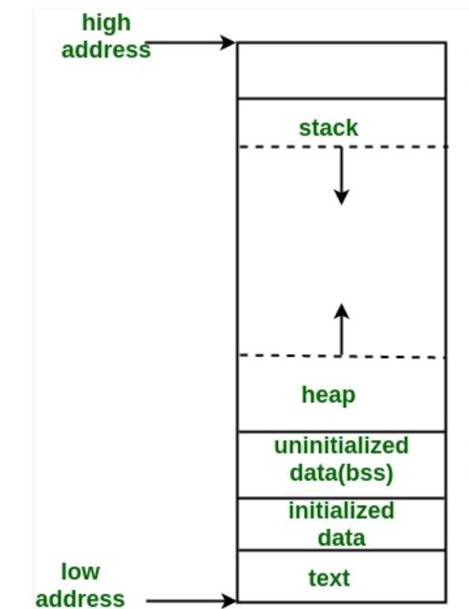

# CS100 Lecture 7

Pointers and Arrays <span style="color: black; font-family: Times New Roman; font-size: 1.05em;">III</span>, Dynamic memory <span style="color: black; font-family: Times New Roman; font-size: 1.05em;">I</span>, Strings <span style="color: black; font-family: Times New Roman; font-size: 1.05em;">I</span>

---

## Contents

- Pointers and Arrays
  - Pointers and `const`
- Dynamic memory
- Strings

---

# Pointers and Arrays

---

## Recap: `const` variables

A `const` variable cannot be modified after initialization.

- It has type `const T` (or equivalently `T const`), where `T` is its original (unqualified) type.
- Any direct modification to a `const` variable is not allowed.

The type of the expression `&x`, where `x` is of type `const T`, is `const T *`.

---

## Pointer to `const`

A pointer to `const` is a pointer whose pointee type is `const`-qualified:

```c
const int x = 42;
int *pi = &x; // Dangerous: It discards the const qualifier.
const int *cpi = &x; // Better.
```

The type of `cpi` is `const int *` (or equivalently, `int const *`), which is a pointer to `const int`.

---

## `const` is a "lock"

`const` is like a lock, guarding against modifications to the variable.

It is very dangerous to let a pointer to non-`const` point to a `const` variable: It is an attempt to remove the lock!

- Warning in C, error in C++.

```c
const int x = 42;
int *pi = &x; // Dangerous: It discards the const qualifier.
const int *cpi = &x; // Better.
++*pi; // No error is generated by the compiler, but actually undefined behavior.
```

Any indirect modification to a `const` variable is **undefined behavior**.

---

## `const` is a "lock"

`const` is like a lock, guarding against modifications to the variable.

A pointer to `const` can point to a non-`const` variable: This is adding a lock.

```c
int x = 42;
int *pi = &x;
const int *cpi = &x; // OK.
++*pi; // Correct, same as ++x.
++*cpi; // Error!
```

---

## `const` is a "lock"

A pointer to `const` can also point to a non-`const` variable: This is adding a lock.

- **A pointer to `const` *thinks* that it is pointing to a `const` variable.** Therefore, it does not allow you to modify the variable through it.

```c
int x = 42;
int *pi = &x;
const int *cpi = &x; // OK.
++*pi; // Correct, same as ++x.
++*cpi; // Error!
```

Such `const`ness on the **pointee type** is often called "low-level `const`ness".

---

## `const` can be helpful

It tells the compiler "this variable should not be modified!".

```c
int count(const int *a, int n, int value) {
  int cnt = 0;
  for (int i = 0; i < n; ++i)
    if (a[i] = value) // Error: cannot modify a[i]
      ++cnt;
  return cnt;
}
```

**[Best practice]** <u>Use `const` whenever possible.</u>

We will see more usage of `const` in C++.

---

## Top-level `const`ness

A pointer itself can also be `const`. The type of such pointer is `PointeeType *const`.

- Such `const`ness is often called "top-level `const`ness".

```c
int x = 42;
int *const pc = &x;
++*pc; // OK.
int y = 30;
pc = &y; // Error.
```

A `const` pointer cannot switch to point to other variables after initialization.

A pointer can have both low-level and top-level `const`ness:

```c
const int *const cipc = &x;
```

---

## `void *`

A special pointer type:

- Any pointer can be implicitly converted to that type.
- A pointer of type `void *` can be implicitly converted to any pointer type.
- Use `printf("%p", ptr);` to print the value of a pointer `ptr` of type `void *`.
  - If `ptr` is a pointer of some other type, a conversion is needed:
    
    ```c
    printf("%p", (void *)ptr);
    ```

---

## `void *`

C does not have a static type system as powerful as C++'s. `void *` is often used to represent "pointer to anything", "location of some memory", or even "any object".

- Typically, the memory allocation function `malloc` (see below) returns `void *`, the address of the block of memory allocated.
  - Memory does not have types. - We say "a disk of 1TB" instead of "a disk that can hold $2^{38}$ `int`s".

---

# Dynamic memory

---

## A "dynamic array"

Create an "array" whose size is determined at runtime?

---

## A "dynamic array"

Create an "array" whose size is determined at runtime?

- We need a block of memory, the size of which can be determined at runtime.
- If we run out of memory, **we need to know**.
- We may require a pretty large chunk of memory.

---

## Stack memory vs heap memory

<div style="display: grid; grid-template-columns: 1fr 1fr;">
  <div>
    <a align="center">
      
    </a>
  </div>
  <div>

- Stack memory is generally smaller than heap memory.
- Stack memory is often used for storing local and temporary objects.
- Heap memory is often used for storing large objects, and objects with long lifetime.
- Operations on stack memory is faster than on heap memory.

  </div>
</div>

---

## Use [`malloc`](https://en.cppreference.com/w/c/memory/malloc) and [`free`](https://en.cppreference.com/w/c/memory/free)

Declared in `<stdlib.h>`.

```c
void *malloc(size_t size);
```

Allocates `size` bytes of uninitialized storage on heap.

If allocation succeeds, returns the starting address of the allocated memory block.

If allocation fails, a null pointer is returned.

- `size_t`: A type that can hold the size (number of bytes) of any object. It is
  - declared in `<stddef.h>`, and
  - is an **unsigned** integer type,
  - whose size is implementation-defined. For example, it may be 64-bit on a 64-bit machine, and 32-bit on a 32-bit machine.

---

## Use [`malloc`](https://en.cppreference.com/w/c/memory/malloc) and [`free`](https://en.cppreference.com/w/c/memory/free)

Declared in `<stdlib.h>`.

```c
void *malloc(size_t size);
```

```c
Type *ptr = malloc(sizeof(Type) * n); // sizeof(Type) * n bytes
for (int i = 0; i != n; ++i)
  ptr[i] = /* ... */
// ...
free(ptr);
```

To avoid **memory leaks**, the starting address of that block memory must be passed to `free` when the memory is not used anymore.

---

## Use [`malloc`](https://en.cppreference.com/w/c/memory/malloc) and [`free`](https://en.cppreference.com/w/c/memory/free)

Declared in `<stdlib.h>`.

```c
void free(void *ptr);
```

Deallocates the space previously allocated by an allocation function (such as `malloc`).

If `ptr` is a null pointer, this function does nothing.

- There is no need to do a null check before calling `free`!

**The behavior is undefined** if `ptr` is not equal to an address previously returned by an allocation function.

---

## Use [`malloc`](https://en.cppreference.com/w/c/memory/malloc) and [`free`](https://en.cppreference.com/w/c/memory/free)

Declared in `<stdlib.h>`.

```c
void free(void *ptr);
```

Deallocates the space previously allocated by an allocation function (such as `malloc`).

**The behavior is undefined** if the memory area referred to by `ptr` has already been deallocated.

- In other words, "double `free`" is undefined behavior (and often causes severe runtime errors).

After `free(ptr)`, `ptr` no longer points to an existing object, so it is no longer dereferenceable.

- Often called a "dangling pointer".

---

## Use `malloc` and `free`

We can also create one object dynamically (on heap):

```c
int *ptr = malloc(sizeof(int));
*ptr = 42;
printf("%d\n", *ptr);
// ...
free(ptr);
```

But why? Why not just create one normal variable like `int ival = 42;`?

---

## Use `malloc` and `free`

Benefit: The lifetime of a dynamically allocated object goes beyond a local scope.

It is not destroyed until we `free` it.

```c
int *create_array(void) {
  int a[N];
  return a; // Returns the address of the local object `a`.
            // When the function returns, `a` will be destroyed, so that
            // the returned address becomes invalid.
            // Dereferencing the returned address is undefined behavior.
}
int *create_dynamic_array(int n) {
  return malloc(sizeof(int) * n); // OK. The allocated memory is valid until
                                  // we free it.
}
```

---

## Use `malloc` and `free`

Create a "2-d array" on heap?

<div style="display: grid; grid-template-columns: 1fr 1fr;">
  <div>

```c
int **p = malloc(sizeof(int *) * n);
for (int i = 0; i < n; ++i)
  p[i] = malloc(sizeof(int) * m);
for (int i = 0; i < n; ++i)
  for (int j = 0; j < m; ++j)
    p[i][j] = /* ... */
for (int i = 0; i < n; ++i)
  free(p[i]);
free(p);
```
  </div>
  <div>

<a align="center">
  
</a>
  </div>
</div>

---

## Use `malloc` and `free`

Create a "2-d array" on heap? - Another way: Create a 1-d array of length `n * m`.

```c
int *p = malloc(sizeof(int) * n * m);
for (int i = 0; i < n; ++i)
  for (int j = 0; j < m; ++j)
    p[i * m + j] = /* ... */
// ...
free(p);
```

---

## Use [`calloc`](https://en.cppreference.com/w/c/memory/calloc)

Declared in `<stdlib.h>`

```c
void *calloc(size_t num, size_t each_size);
```

Allocates memory for an array of `num` objects (each of size `each_size`), and initializes all bytes in the allocated storage to zero.

- "All bytes zero" does not necessarily mean `0.0` for floating point or null pointer value for pointers, although it does for most modern computers and compilers.

Similar as `malloc(num * each_size)`. Returns a null pointer on failure.

---

## `malloc`, `calloc` and `free`

The behaviors of `malloc(0)`, `calloc(0, N)` and `calloc(N, 0)` are **implementation-defined**:

- They may or may not allocate memory.
- If no memory is allocated, a null pointer is returned.
- They may allocate *some* memory, for some reasons. In that case, the address of the allocated memory is returned.
  - You cannot dereference the returned pointer.
  - It still constitutes **memory leak** if such memory is not `free`d.

---

# Strings

---

## C-style strings

